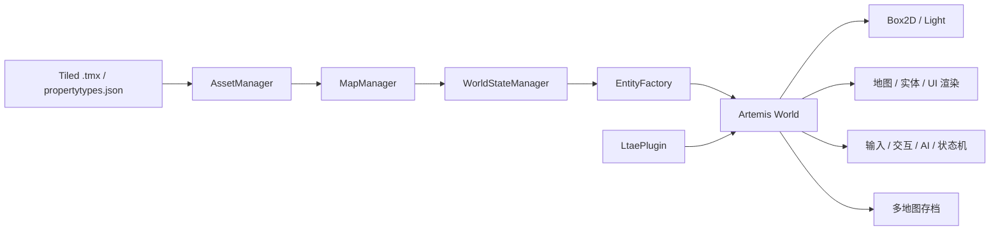
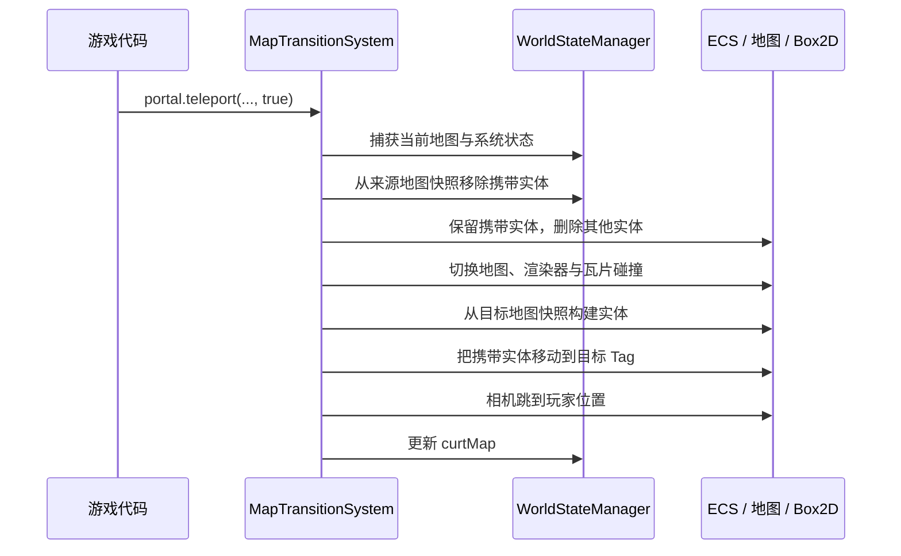

# LTAE

LTAE（LibGDX Tiled Artemis Engine）是一个面向 2D 游戏的 Artemis-ODB 插件。它把 Tiled 地图中的对象转换为 ECS 实体，并在此基础上提供渲染、Box2D、输入、交互、状态机、行为树、Scene2D UI、Ink 剧情以及多地图存档/读档能力。

LTAE 不是一个独立运行的游戏，也不接管 LibGDX 的 `ApplicationListener` 或 `Screen` 生命周期。游戏项目负责配置规则、加载资源、创建 Artemis `World` 和驱动每帧更新；LTAE 负责解释地图数据并安装通用 ECS 系统。

当前版本：`3.8.0.8`

## 1. 环境与依赖

- JDK 21
- Gradle 8.14.5（项目当前使用版本）
- LibGDX 1.14.2
- Artemis-ODB 2.3.0
- Tiled 1.11.x 至 1.12.x
- 使用 gdx-liftoff 风格的资源模块，并生成 `assets.txt`

通过 JitPack 引入：

```gradle
repositories {
    maven { url 'https://jitpack.io' }
}

dependencies {
    api "com.github.IteratingSystem:LTAE:3.8.0.8"
}
```

LTAE 还集成了 box2dlights、gdx-ai、blade-ink、Artemis contrib event bus、extended component mapper 和 profiler 等依赖。

## 2. 总体架构



主要职责如下：

| 模块 | 职责 |
| --- | --- |
| `AssetManager` | 根据 `assets.txt` 批量加载地图、纹理、行为树、Ink 和噪声纹理 |
| `MapManager` | 解析全部地图的实体层与物理层，保存不可变的初始实体数据 |
| `WorldStateManager` | 管理一次游戏会话的当前地图、各地图实体快照和系统属性 |
| `EntityBuilder` / `EntitySerializer` | 在 Tiled 数据、存档数据和运行时实体之间转换 |
| `LtaePlugin` | 向 Artemis `World` 安装引擎系统和第三方插件 |
| `EventSystem` | 在游戏代码与引擎系统之间传递实体、地图、相机、UI 等命令 |

## 3. 最小接入流程

初始化顺序是引擎契约的一部分。尤其要保证：资源加载完成后才能初始化 `MapManager`，创建 `World` 前必须先建立或载入 `WorldState`。

### 3.1 配置规则

在加载资源和创建世界之前设置 `LtaePluginRule`：

```java
LtaePluginRule.GAME_WIDTH = 640;
LtaePluginRule.GAME_HEIGHT = 360;
LtaePluginRule.UI_WIDTH = 640;
LtaePluginRule.UI_HEIGHT = 360;
LtaePluginRule.UI_ZOOM = 1f;

LtaePluginRule.CAMERA_ZOOM = 1f;
LtaePluginRule.WORLD_SCALE = 1f / 16f;
LtaePluginRule.G_X = 0f;
LtaePluginRule.G_Y = -9.8f;
LtaePluginRule.B2D_SLEEP = false;
LtaePluginRule.COMB_TILE = true;

LtaePluginRule.MAP_NAME = "island";
LtaePluginRule.SKIN_PATH = "skin/main.json";
LtaePluginRule.ENABLE_LIGHT = true;

LtaePluginRule.ENTITY_LAYERS.put("island", "entities");
LtaePluginRule.PHY_LAYERS.put("island", new String[]{"ground", "wall"});
```

每张需要参与游戏的地图都应在 `ENTITY_LAYERS` 中配置实体对象层，在 `PHY_LAYERS` 中配置零个或多个静态碰撞层。

### 3.2 注册反射根包

LTAE 通过类的简单名称寻找游戏项目中的状态、输入处理器、交互监听器、碰撞监听器和 Shader uniform 类：

```java
ReflectionManager.setRootClass(MainGame.class);
```

传入游戏项目根包内的类。未调用时，引擎只能扫描自己的包，游戏侧扩展类将无法实例化。

### 3.3 加载资源

这里使用的是 `org.ltae.manager.AssetManager`，不是直接使用 LibGDX 同名类：

```java
AssetManager assets = AssetManager.getInstance();
assets.setLoaders("propertytypes.json");
assets.loadAssets();

// 在加载页面每帧调用
assets.update();
float progress = assets.getProgress();
```

当 `progress >= 1f` 后初始化地图数据：

```java
MapManager.init(
    LtaePluginRule.ENTITY_LAYERS,
    LtaePluginRule.PHY_LAYERS
);
```

`MapManager.init` 在一个应用进程中只会初始化一次。不要在每次进入游戏页面时重复调用。

### 3.4 建立新游戏或读取存档

新游戏：

```java
WorldStateManager.getInstance()
    .startNewGame(LtaePluginRule.MAP_NAME);
```

读取已有 JSON 存档：

```java
WorldStateManager.getInstance().loadSaveJson(saveJson);
```

二者必须在 `new World(...)` 之前完成，因为 `LtaePlugin` 创建地图系统和存档恢复系统时就会读取当前 `WorldState`。

### 3.5 创建并驱动 ECS World

```java
WorldConfiguration configuration = new WorldConfigurationBuilder()
    .with(new LtaePlugin())
    // 游戏自己的系统可继续添加
    .build();

World world = new World(configuration);

EntityEvent build = new EntityEvent(EntityEvent.BUILD_ALL);
world.getSystem(EventSystem.class).dispatch(build);
```

每帧：

```java
world.setDelta(Gdx.graphics.getDeltaTime());
world.process();
```

窗口尺寸变化时通知相机：

```java
CameraEvent resize = new CameraEvent(CameraEvent.RESIZE);
resize.width = width;
resize.height = height;
world.getSystem(EventSystem.class).dispatch(resize);
```

页面退出时调用 `world.dispose()`；应用退出时再释放资源：

```java
AssetManager.getInstance().dispose();
```

## 4. `LtaePluginRule` 配置表

| 字段 | 默认值 | 作用 |
| --- | --- | --- |
| `ENTITY_LAYERS` | 空 | `地图名 -> 实体对象层名` |
| `PHY_LAYERS` | 空 | `地图名 -> 物理层名数组` |
| `UI_WIDTH`, `UI_HEIGHT` | `640`, `480` | Scene2D UI 的逻辑尺寸 |
| `UI_ZOOM` | `1` | `UIStage` 私有视口缩放默认值 |
| `GAME_WIDTH`, `GAME_HEIGHT` | `640`, `480` | 游戏相机逻辑尺寸 |
| `CAMERA_ZOOM` | `1` | 初始相机缩放 |
| `WORLD_SCALE` | `1` | 像素到世界单位的转换比例 |
| `G_X`, `G_Y` | `0`, `-9.8` | Box2D 重力 |
| `B2D_SLEEP` | `false` | Box2D 是否允许休眠 |
| `COMB_TILE` | `true` | 是否合并地图瓦片碰撞形状 |
| `MAP_NAME` | `defaultMap` | 默认初始地图名 |
| `SKIN_PATH` | `skin/main.json` | Scene2D `Skin` 路径 |
| `AUTO_COMP_CLASSES` | `Pos`, `Render`, `ZIndex` | Tiled 对象未显式声明时仍自动创建的组件 |
| `ENABLE_LIGHT` | `false` | 是否启用 box2dlights |

`PREFABRICATED_MAP_NAME`、`PHY_LAYER`、`ENTITY_LAYER` 仍保留在规则类中，但当前引擎实现没有读取它们。新代码应使用按地图配置的 `ENTITY_LAYERS` 和 `PHY_LAYERS`，不要依赖这三个兼容字段。

## 5. 资源管线

`AssetManager.loadAssets()` 根据 `assets.txt` 自动识别以下文件：

| 扩展名 | 加载结果 |
| --- | --- |
| `.tmx` | `TiledMap` |
| `.tree` | gdx-ai `BehaviorTree` |
| `.ink.json` | Ink `Story` |
| `.noise.png` | 噪声 `Texture` |
| `.png` | 普通 `Texture` |

`assets.txt` 必须在打包前由资源模块生成。不要使用 `FileHandle.list()` 扫描 jar 内资源；它在桌面开发目录中可能可用，但打包为 jar 后不可靠。

单独加载和读取资源：

```java
assets.loadAsset("maps/island.tmx", TiledMap.class);
TiledMap map = assets.getObejct("maps/island.tmx", TiledMap.class);
ObjectMap<String, TiledMap> maps = assets.getObjects(".tmx", TiledMap.class);
```

注意：当前公开方法名确实是 `getObejct`，拼写不要擅自改成 `getObject`。

## 6. 使用 Tiled 定义实体

### 6.1 基本约定

1. 在 Tiled 中导入项目使用的 `propertytypes.json`。
2. 在 `ENTITY_LAYERS` 指定的对象层中创建对象。
3. Tiled 对象的 `name` 会成为 Artemis `Tag`。
4. 自定义类属性名必须等于 Java 组件的简单类名，例如 `Pos`、`B2dBody`、`Portal`。
5. 类属性内字段名必须与组件的公共字段名一致。
6. 只有带 `@SerializeParam` 的字段会进入实体快照和存档。

LTAE 使用 `fromMap + mapObjectId` 重新关联实体和原始 Tiled `MapObject`。Artemis 运行时 `entityId` 在重建后可能改变，不应作为跨存档的业务主键。

仓库内的基础 `src/main/resources/propertytypes.json` 可作为起点，但游戏项目应维护与当前组件类一致的版本。当前基础文件仍含历史名称 `OnInteractive`（Java 中实际为 `Interactive`）和 `TileAnimation.playModeName`（Java 中实际为 `playMode`），并缺少若干较新的组件；不要未经核对直接照搬。

### 6.2 自动组件

默认情况下，每个地图实体都会拥有：

- `Pos`：世界坐标和运行时 MapObject 关联。
- `Render`：纹理帧、翻转、可见性和渲染参数。
- `ZIndex`：渲染顺序，可通过 `followY` 根据 Y 坐标动态计算。

可在创建世界前替换 `LtaePluginRule.AUTO_COMP_CLASSES`。自定义类必须是 Artemis `Component`。

### 6.3 自定义可序列化组件

```java
public class Health extends SerializeComponent {
    @SerializeParam
    public int current;

    @SerializeParam
    public int maximum;

    // Texture、Body、监听器等运行时对象在这里重建
    @Override
    public void reload(World world, EntityDatum datum) {
        super.reload(world, datum);
    }

    // 保存前把运行时状态同步回被标注字段
    @Override
    public void beforeSerialization() {
    }
}
```

规则：

- 需要由 Tiled 和存档构建的组件继承 `SerializeComponent`。
- 持久化字段必须是 `public` 且带 `@SerializeParam`。
- `reload(World, EntityDatum)` 在组件字段恢复后执行，用来重建不可 JSON 化的运行时对象。
- `beforeSerialization()` 在生成快照前执行，用来同步派生状态。
- 未标注字段不会保存，这是设计行为。
- `SerializeComponent.reload` 会通过 `fromMap` 和 `mapObjectId` 找回原始 Tiled 对象。需要进入存档的运行时生成实体，应从地图模板的 `EntityDatum` 构建，或由游戏代码提供等价且可恢复的来源信息。

## 7. 内置组件

| 组件 | 用途与关键点 |
| --- | --- |
| `Pos` | 实体 `x/y`；可 `set`、`copy`，并与 `B2dBody` 同步 |
| `Render` | 当前纹理帧、可见性、翻转、偏移、缩放和旋转；只有 `visible` 被序列化 |
| `ZIndex` | 控制批次排序；`followY` 开启后按纵坐标更新 |
| `B2dBody` | 根据 Tiled 对象/瓦片对象重建 Body 和 Fixture；支持 `setPos`、`flipX` |
| `StateComp` | 通过枚举简单类名建立 gdx-ai 状态机，保存前记录当前状态 |
| `BTree` | 通过 `treeName` 绑定 `.tree` 资源并以实体作为黑板对象 |
| `TileAnimation` | 单个 Tiled 动画，支持 LibGDX `Animation.PlayMode`、暂停和帧查询 |
| `TileAnimations` | 从 tileset 收集多个具名动画，通过 `current` 切换 |
| `LayerSampling` | 把某地图瓦片层采样为实体纹理，可跟随该层动画 |
| `ShaderComp` | 为单个实体选择 `.vert`、`.frag` 和可选 uniform 处理类 |
| `Portal` | 描述 `targetMap`、`targetPosEntity` 并发起跨地图迁移 |
| `Direction` | 保存水平、垂直和正交方向 |
| `InputProcess` | 反射创建游戏侧 `InputProcessing`，`enabled` 控制是否更新 |
| `Interactive` | 反射创建游戏侧 `OnInteractListener`，支持独占交互标记 |
| `Player` | 无字段的玩家标识组件 |
| `Inert` | 让实体退出多种逻辑和渲染系统的处理 |
| `LastId` | 保存序列化前的运行时实体 ID，仅用于重建过程中的关联 |
| `SoarHeight` | 表示实体的视觉悬浮高度 |
| `Script` | 当前为空的预留组件，尚无执行它的引擎系统 |

`PosFollowBodySystem` 会让 `Pos` 跟随 Box2D Body。直接改 `Pos` 后若实体拥有 Body，应同时调用 `b2dBody.setPos(pos)`。

### 7.1 动画切换

在 tileset 的动画瓦片上添加名为 `TileAnimation` 的类属性，并设置 `name`、`playMode`、`offsetX`、`offsetY`。实体挂载 `TileAnimations` 后：

```java
TileAnimations animations = world.getMapper(TileAnimations.class).get(entityId);
animations.changeAnimation("run");

TextureRegion frame = animations.getKeyFrame();
boolean ending = animations.isLast(1);
boolean finished = animations.isAnimationFinished();
```

### 7.2 左右翻转

纹理、Body 和动画帧形状需要保持一致：

```java
boolean flip = direction.horizontal == HorizontalDir.LEFT;
render.flipX = flip;
b2dBody.flipX(render.keyframe.getRegionWidth());
b2dBody.needFlipX = flip;
```

`needFlipX` 会让之后按动画帧新建的形状使用同一方向。目前形状翻转主要针对圆形与矩形。

## 8. 事件总线

获取并派发事件：

```java
EventSystem events = world.getSystem(EventSystem.class);
events.dispatch(event);
```

事件对象既是输入参数，也是同步返回值容器。派发完成后可读取系统写回的字段。

### 8.1 实体事件

| 类型 | 输入/结果 |
| --- | --- |
| `BUILD_ALL` | 从当前地图的 `EntityData` 构建全部实体 |
| `BUILD_ENTITY` | 输入 `entityDatum`；返回 `entityId`、`entity` |
| `BUILD_ENTITIES` | 输入 `entityData` |
| `DELETE_ENTITY` | 输入 `entityId` |
| `DELETE_ALL` | 删除全部实体 |
| `DEL_AND_CREATE_ALL` | 可选输入 `entityData`，删除后重建 |
| `FILTER_DEL_ALL` | 输入 `entityTags`，保留这些 Tag 对应实体 |
| `SERIALIZER_ENTITIES` | 返回 `serializerEntitiesStr` |
| `CREATE_ENTITY_DATUM` | 输入 `entityId`；返回 `entityDatum` |

`CREATE_ENTITY`、`CREATE_PREFAB`、`GET_MAP_OBJECT`、`ADD_AUTO_COMP` 常量仍存在，但当前 `EntityFactory` 没有处理这些分支，不应作为公开工作流使用。

示例：

```java
EntityEvent request = new EntityEvent(EntityEvent.CREATE_ENTITY_DATUM);
request.entityId = playerId;
events.dispatch(request);
EntityDatum snapshot = request.entityDatum;
```

### 8.2 其他事件

| 事件 | 类型 |
| --- | --- |
| `UIEvent` | `REGISTER`, `SHOW`, `HIDE`, `ONLY_SHOW`, `HIDE_ALL`, `GET_TABLE` |
| `CameraEvent` | `SET_TARGET`, `RESIZE`, `JUMP_POS`, `UPDATE_ZOOM` |
| `InteractEvent` | `SHORT_PRESS`, `LONG_PRESS` |
| `MapEvent` | `CHANGE_MAP` |
| `B2dEvent` | `DEL_TILE_COLLIDER`, `CREATE_TILE_COLLIDER` |
| `SystemEvent` | `RESTORE_PROPS` |

## 9. 物理与碰撞

`B2dSystem` 根据 `PHY_LAYERS` 创建地图静态碰撞体，根据实体的 `B2dBody` 创建动态对象。Tiled 瓦片对象可通过 `FixDef` 类属性配置 Fixture：

实体的 `B2dBody` 类属性负责 Body 本身：`defType` 选择 `StaticBody`、`KinematicBody` 或 `DynamicBody`，`defFixed` 控制固定旋转，`linearDamping` 设置线性阻尼。

- `density`
- `friction`
- `restitution`
- `isSensor`
- `sensorType`
- `categoryBit`
- `maskBits`
- `listenerSimpleName`

碰撞分类通过 `CategoryBits` 枚举解析：

```java
short mask = CategoryBits.getMask("I,II");
```

当前解析器直接按逗号分隔并调用 `Enum.valueOf`，名称区分大小写且不要在逗号两侧加入空格。

游戏侧监听器继承以下基类之一：

- `EcsContactListener`：普通 ECS 碰撞监听。
- `SensorContactListener`：传感器监听。
- `ShapeContactListener`：形状级监听。

监听类由 `listenerSimpleName` 反射查找，并必须提供构造器：

```java
public PlayerContact(Entity entity) {
    super(entity);
}
```

Box2D 传感器通常只可靠触发 `beginContact` / `endContact`，不要依赖其 `preSolve` / `postSolve`。

当 LibGDX 日志级别为 `Logger.DEBUG` 时，`RenderPhysicsSystem` 会绘制 Box2D 调试形状。

## 10. 渲染、相机、光照与 Shader

渲染顺序：地图 -> 实体批次 -> 物理调试 -> UI。实体按 `ZIndex` 排序，`Render.visible` 控制是否绘制，`Inert` 实体会被多个渲染/更新系统排除。

### 10.1 相机跟随

```java
CameraTarget target = new CameraTarget("PLAYER");
target.activeWidth = 40;
target.activeHeight = 40;
target.eCenterX = 140;
target.eCenterY = 90;
target.progress = 0.03f;

CameraEvent event = new CameraEvent(CameraEvent.SET_TARGET);
event.target = target;
events.dispatch(event);
```

立即跳转到某位置：

```java
CameraEvent jump = new CameraEvent(CameraEvent.JUMP_POS);
jump.pos = playerPos;
events.dispatch(jump);
```

### 10.2 Shader

`.vert` 和 `.frag` 文件由 `ShaderManager` 读取为源码。给实体挂载 `ShaderComp`，填写 `vertexName` 和 `fragmentName`。如需每帧设置 uniform，创建 `ShaderUniforms` 子类：

```java
public class HurtUniforms extends ShaderUniforms {
    public HurtUniforms(Entity entity) {
        super(entity);
    }

    @Override
    public void setUniforms(float delta) {
        super.setUniforms(delta);
        shaderProgram.bind();
        shaderProgram.setUniformf("u_time", iTime);
    }
}
```

然后把 `ShaderComp.uniformSimpleName` 设为 `HurtUniforms`。该类必须位于 `ReflectionManager` 配置的游戏根包下。

### 10.3 光照

创建 `World` 前设置 `LtaePluginRule.ENABLE_LIGHT = true`。`LightSystem` 与引擎 Box2D World 和相机协同更新；关闭时保留系统但不启用实际光照流程。

#### 动态环境光与地图配置

`DynamicAmbientLight` 根据游戏时间更新环境光，并根据 `TiledMapSystem` 的当前地图选择配置。引擎不限定游戏的时间系统；游戏侧时间系统只需实现 `AmbientLightTimeSource`：

```java
public class DateTimeSystem extends BaseSystem implements AmbientLightTimeSource {
    public int hour;
    public int minute;

    @Override
    public int getHour() {
        return hour;
    }

    @Override
    public int getMinute() {
        return minute;
    }
}
```

`AmbientLightProfile.hourly(...)` 接收严格 24 个 `Color`，分别表示 0 点到 23 点的颜色。系统根据当前分钟向下一小时颜色平滑插值。`AmbientLightProfile.constant(...)` 创建全天不变的配置，适合室内或不受世界昼夜影响的地图：

```java
AmbientLightProfile worldProfile = AmbientLightProfile.hourly(hourlyColors);
AmbientLightProfile indoorProfile = AmbientLightProfile.constant(
    new Color(1f, 1f, 1f, 1f)
);

AmbientLightConfig lightConfig = new AmbientLightConfig(worldProfile)
    .setMapProfile("house", indoorProfile)
    .setMapProfile("shop", indoorProfile);
```

构建 World 时传入同一个时间系统实例：

```java
DateTimeSystem dateTimeSystem = new DateTimeSystem();

WorldConfiguration configuration = new WorldConfigurationBuilder()
    .with(new LtaePlugin())
    .with(dateTimeSystem)
    .with(new DynamicAmbientLight(dateTimeSystem, lightConfig))
    .build();
```

地图选择规则：

1. 当前地图通过 `setMapProfile(mapName, profile)` 配置过时，使用该地图的配置。
2. 当前地图没有专用配置时，自动使用 `AmbientLightConfig` 的默认配置。
3. 地图切换后不需要手动通知动态光照系统，下一帧会根据新的当前地图自动选择配置。

`DynamicAmbientLight` 需要由游戏侧显式加入 World，因为时间来源和颜色配置属于具体游戏。应使用普通优先级注册，使它在 LTAE 最低优先级的 `LightSystem` 渲染前完成更新。

### 10.4 图层采样

`SamplingUtils.getInstance().samplingLayer(map, layerName)` 可直接把一个瓦片层渲染到 `TextureRegion`。`LayerSampling` + `LayerSamplingSystem` 则将这项能力绑定到 ECS 实体，并处理动画层的逐帧采样。返回纹理由 FrameBuffer 持有，长期反复创建时应自行规划释放时机。

## 11. 输入与实体交互

`InputManager` 维护全局 `InputMultiplexer`：

```java
InputManager.addProcessor(processor);
InputManager.removeProcessor(processor);

boolean held = InputManager.isKeyPressed(Input.Keys.W);
boolean once = InputManager.isKeyJustPressed(Input.Keys.SPACE);

InputManager.ENABLE = false; // 全局禁用按键查询
```

### 11.1 实体输入处理器

游戏侧创建无参 `InputProcessing` 子类：

```java
public class PlayerInput extends InputProcessing {
    @Override
    public void update() {
        // 每个 ECS tick 调用
    }
}
```

在 Tiled 的 `InputProcess` 属性中设置：

- `simpleName = PlayerInput`
- `enabled = true`

`InputProcessSystem` 只更新启用的处理器。`InputProcessing.dispose()` 会注销其长按监听器；自定义释放逻辑应保留这一行为。

### 11.2 长按

实现 `LongPressListener`，并通过 `InputManager.addLongPressListener(listener)` 注册。停止使用时调用对应的 `removeLongPressListener`。

### 11.3 交互

给可交互实体挂载 `Interactive`，把 `simpleName` 设为游戏侧 `OnInteractListener` 子类名。监听器必须提供 `(Entity)` 构造器：

```java
public OpenChest(Entity entity) {
    super(entity);
}
```

通过 `InteractEvent(fromId, toId, InteractEvent.SHORT_PRESS)` 或 `LONG_PRESS` 发起交互。给监听器类添加 `@ExclusiveInteract` 可标记为独占交互。

## 12. 状态机与行为树

### 12.1 状态机

游戏状态定义为实现 `State<Entity>` 的枚举。`StateComp` 根据简单类名扫描游戏包、创建状态机，并在保存前记录当前枚举状态。

```java
public enum PlayerState implements State<Entity> {
    IDLE;

    @Override public void enter(Entity entity) {}
    @Override public void update(Entity entity) {}
    @Override public void exit(Entity entity) {}
    @Override public boolean onMessage(Entity entity, Telegram telegram) {
        return false;
    }
}
```

在 Tiled 的 `StateComp` 中填写该枚举的简单类名和初始状态。状态类必须位于反射根包内。

`EceState` 是额外带有 `initialize(Entity)` 方法的便捷接口，但当前 `StateComp` 和 `StateSystem` 不会自动调用该方法；使用它时应由游戏代码自行完成初始化。

### 12.2 行为树

`.tree` 文件会自动加载。实体挂载 `BTree` 并设置 `treeName` 后，`reload` 会把该实体设为行为树对象，`BTreeSystem` 每帧调用 `step()`。

自定义叶节点继承 `EcsLeafTask`，可直接访问：

- `world`
- `entity`
- `entityId`
- `entityTag`
- `tagManager`

内置叶节点：

| 叶节点 | 参数 | 用途 |
| --- | --- | --- |
| `TimeSleep` | `time` | 固定时长等待 |
| `RandomSleep` | `start`, `end` | 随机时长等待 |
| `Range` | `targetEntityTag`, `radius` | 判断目标实体是否进入范围 |

## 13. Scene2D UI 与库存

### 13.1 ECS UI

UI 类继承 `BaseEcsUI`。它本质上是 `Table`，并提供 `world`、`tagManager`、`assetSystem`、`eventSystem` 和 `skin`：

```java
public class HudTable extends BaseEcsUI {
    public HudTable(World world) {
        super(world);
        add(new Label("HUD", skin));
    }
}
```

通过事件注册和控制 UI：

```java
UIEvent register = new UIEvent(UIEvent.REGISTER);
register.table = new HudTable(world);
events.dispatch(register);

UIEvent only = new UIEvent(UIEvent.ONLY_SHOW);
only.uiClass = HudTable.class;
events.dispatch(only);
```

`RenderUISystem` 以 Table 的具体 `Class` 为键，同一类只能注册一个实例。`GET_TABLE` 派发后从 `event.table` 读取结果。

`UIStage` 是使用 LTAE UI 尺寸和 FitViewport 的独立 Stage，可为特殊页面传入私有 zoom。主 ECS UI 则由 `RenderUISystem` 的 `ExtendViewport` 管理。

### 13.2 库存网格

相关类：

- `SlotDatum`：物品 ID、堆叠数量、最大堆叠、类型和图标等格子数据。
- `ItemSlot`：单个可选中、可禁用的格子 Actor。
- `ItemSlotGrid`：二维格子、拖放、合并、交换、来源限制和所有者管理。

```java
DragAndDrop dragAndDrop = new DragAndDrop();
ItemSlotGrid grid = new ItemSlotGrid(world, dragAndDrop, "default-slot");
grid.setOwner(playerId);
grid.setSlotData(slotRows);
grid.rebuild();
```

常用扩展点：

- `onDragStart`：定制拖动载荷。
- `onDrop`：定制格子接收行为，默认同物品合并、不同物品交换。
- `onDragStop`：处理拖到空白处。
- `addBlockedSourceType`：拒绝来自某类库存视图的物品。
- `setCanDragStop(false)`：禁止丢到空白处。
- `setSelectOnly`：单选某格。

调用 `setSlotData` 后必须调用 `rebuild()` 才会生成格子 Actor。

## 14. Ink 剧情、本地化与页面管理

### 14.1 Ink

所有 `.ink.json` 会被自动加载到 `StoryManager`：

```java
StoryManager.changeStory("intro");
Bag<String> lines = StoryManager.getLines();
StoryManager.Continue();
boolean finished = StoryManager.isFinished();
```

`getLines()` 会反复调用 Ink 的 `Continue()`，一次取完当前所有可继续文本，通常会停在选项或故事结束处。`StoryManager.Continue()` 只推进一次；不要在 `getLines()` 已经耗尽当前段落后无条件继续调用。使用前先通过 `changeStory` 选择已加载故事。

### 14.2 本地化

`BundleManager` 使用 LibGDX 原生 AssetManager：

```java
BundleManager.initialize(gdxAssetManager, "i18n/messages", "zh");
String title = BundleManager.get("menu.title");
BundleManager.changeLanguage("en");
```

`changeLanguage` 会卸载并同步重新加载 bundle，适合语言切换而非每帧调用。

### 14.3 Game 与 Screen 注册表

```java
GameManager.setCurrent(game);
Game current = GameManager.getCurrent();

ScreenManager.register(menuScreen);
Screen menu = ScreenManager.getScreen(MenuScreen.class);
GameManager.getCurrent().setScreen(menu);
```

`ScreenManager` 只负责按类保存和查找 Screen，不会自动执行 `Game.setScreen`。

## 15. 存档、读档与多地图切换

### 15.1 数据模型

一次游戏会话由单例 `WorldStateManager` 持有：

```text
WorldState
├── curtMap                         当前地图
├── entityData[mapName]             每张地图的实体快照
└── systemProps[systemClassName]    可序列化系统属性
```

新游戏并不是只创建当前地图。`startNewGame(initialMap)` 会从 `MapManager` 的初始模板复制所有地图的 `EntityData`，因此尚未进入的地图也有独立初始状态。

### 15.2 保存

```java
String json = WorldStateManager.getInstance()
    .createSaveJson(world);
```

`createSaveJson` 会先：

1. 从当前 ECS World 序列化当前地图全部实体。
2. 把结果覆盖到 `entityData[currentMap]`。
3. 采集所有 `@SerializeSystem` 系统中的 `@SerializeParam` 公共字段。
4. 序列化完整 `WorldState`。

仅调用 `getSaveJson()` 不会先捕获运行时变化；正常保存应使用 `createSaveJson(world)`。

### 15.3 读档

```java
WorldStateManager state = WorldStateManager.getInstance();
state.loadSaveJson(json);

World world = new World(
    new WorldConfigurationBuilder()
        .with(new LtaePlugin())
        .build()
);

events = world.getSystem(EventSystem.class);
events.dispatch(new EntityEvent(EntityEvent.BUILD_ALL));
```

读档的正确含义是“先用 JSON 替换会话状态，再创建新的 ECS World”。不要先创建 World 再调用 `loadSaveJson`，否则地图系统已经按旧状态初始化。

### 15.4 保存自定义系统字段

```java
@SerializeSystem
public class QuestSystem extends BaseSystem {
    @SerializeParam
    public int chapter;

    @Override
    protected void processSystem() {}
}
```

`SysPropsRestoreSystem` 在 World 初始化阶段按系统完整类名恢复字段。改动系统包名或类名会使旧存档找不到对应记录；字段类型和字段名同样属于存档格式。

### 15.5 Portal 切图

在 Tiled 实体上挂载 `Portal`：

- `targetMap`：目标地图名，必须与 MapManager 使用的地图名一致。
- `targetPosEntity`：目标地图内作为出生点的实体 Tag。

触发传送：

```java
Portal portal = world.getMapper(Portal.class).get(portalEntityId);
int[] carried = {playerId, companionId};
portal.teleport(carried, playerId, true);
```

`switchMap = true` 的事务顺序：



目标地图与当前地图相同时，不重建世界，只把携带实体移动到 `targetPosEntity`。

`switchMap = false` 表示只迁移数据：实体会从当前地图快照和 ECS World 中删除，其最新快照被加入目标地图，但当前地图、渲染器和相机不切换。适合把 NPC、掉落物等送往其他地图。

关键约束：

- `entityIds` 必须包含所有需要跨图保留的运行时实体。
- `playerEntityId` 仅用于切图后相机跳转。
- 携带实体应有 `Pos`；有 `B2dBody` 时位置会同步到 Body。
- 找不到目标 Tag 时实体会被放到 `(0, 0)` 并记录错误日志。
- 目标地图快照由 `WorldStateManager.getEntityData(targetMap)` 提供，不存在时会创建空数据。

## 16. LtaePlugin 安装的系统

正常设计下，插件负责以下系统：

| 阶段 | 系统 |
| --- | --- |
| 基础设施 | `EventSystem`, `AssetSystem`, `TiledMapSystem`, `B2dSystem` |
| 游戏逻辑 | `InputProcessSystem`, `OnInteractSystem`, `MapTransitionSystem`, `PosFollowBodySystem`, `BTreeSystem`, `StateSystem`, `CameraSystem`, `KeyframeShapeSystem`, `TileAnimSystem`, `LayerSamplingSystem`, `ZIndexSystem` |
| 渲染 | `RenderTiledSystem`, `RenderBatchingSystem`, `RenderFrameSystem`, `RenderPhysicsSystem` |
| 最低优先级 | `SysPropsRestoreSystem`, `EntityFactory`, `LightSystem`, `RenderUISystem` |

同时依赖：

- `ExtendedComponentMapperPlugin`
- `ProfilerPlugin`
- `TagManager`
- `PlayerManager`
- `TeamManager`
- `EntityLinkManager`

## 17. 实用工具与底层入口

- `JsonManager`：统一的 LibGDX JSON `toJson` / `fromJson`。
- `SkinManager.getSkin(path)`：加载或获取 Scene2D Skin。
- `ShaderManager`：读取已加载的 vertex/fragment shader 文本。
- `ShapeUtils`：从 Tiled `MapObject` 创建 Box2D Shape，并支持水平翻转。
- `SamplingUtils`：把地图瓦片层渲染成纹理。
- `MapManager.getTiledMap(name)`：按地图名取 TiledMap。
- `MapManager.getMapObject(map, id)`：按来源地图和对象 ID 重新关联对象。
- `MapManager.getPhyLayer(map)`：取得配置的物理层。
- `EntityBuilder` / `EntitySerializer` / `EntityDeleter`：底层实体构建、快照和删除 API。业务代码优先使用事件或 `WorldStateManager`，避免绕过会话状态。

`org.ltae.script.Script` 和 `LtaePluginRuleChange` 当前也是未接入运行时流程的预留类型，不应把它们视为已经完成的脚本系统或自动规则配置入口。

## 18. 已知限制与排查

### `WorldState is not initialized`

创建 `World` 之前未调用 `startNewGame` 或 `loadSaveJson`。

### 地图或实体层为空

确认资源已经 `update()` 到 100%，随后才调用 `MapManager.init`；同时检查地图名是否与 `ENTITY_LAYERS` 的 key 一致。

### 游戏侧反射类找不到

确认已调用 `ReflectionManager.setRootClass(MainGame.class)`，类位于该根包下，Tiled 中填写的是简单类名，并满足构造器约定。

### Tiled 组件没有生成

确认 `propertytypes.json` 中的类型名与 Java 组件简单类名完全一致。不要继续使用旧文档中的 `OnInteractive`、`BaseUI` 或 `LtaeBuilder`。

### 存档后字段丢失

只有公共且标注 `@SerializeParam` 的字段会保存。Body、Texture、监听器、状态机等运行时对象应由 `reload` 重建。

### 读档后实体 ID 改变

这是 Artemis 重建实体的正常结果。持久身份应使用 Tiled 来源信息、Tag 或游戏自己的稳定 ID。

### 无物理 Body 的实体读档后回到 Tiled 初始坐标

当前 `Pos.reload()` 无条件从原始 `MapObject` 重新设置 `x/y`。拥有 `B2dBody` 的实体会用快照坐标重建 Body，之后 `PosFollowBodySystem` 可把位置同步回来；只有 `Pos` 而没有 Body 的自由移动实体则会保留 Tiled 初始坐标。这是当前实现行为，需要保存此类实体位置时应先修正 `Pos.reload` 生命周期。

### jar 中找不到资源

不要依赖 `FileHandle.list()`；检查资源模块是否正确生成并打包 `assets.txt`。

### 自动化验证范围

当前仓库没有 `src/test` 下的自动化测试套件，只有 `src/main/java/org/ltae/test/ReflectionsTest.java` 辅助类。版本升级后应至少在实际游戏项目中验证：新游戏、保存、读档、同图传送、跨图传送、携带实体、系统字段恢复和 UI 输入链路。

## 19. 推荐的项目侧分层

为了避免存读档和切图逻辑再次分散，游戏项目建议保持以下边界：

- 菜单/存档 UI：只负责读取文件或字符串，并调用 `startNewGame` / `loadSaveJson`。
- 游戏 Screen：只负责按既定状态创建、驱动、销毁 ECS World，并派发首次 `BUILD_ALL`。
- 存档服务：只通过 `createSaveJson(world)` 获取最新完整存档。
- 门、剧情和交互代码：只调用 `Portal.teleport(...)`，不自行拼接删除、建图、重建和相机步骤。
- 自定义组件：只声明可保存数据与 `reload` 生命周期，不直接管理整个 WorldState。
- 自定义系统：需要跨存档的数据统一使用 `@SerializeSystem` + `@SerializeParam`。

这样，Tiled 负责静态初始定义，`WorldStateManager` 负责会话数据，`MapTransitionSystem` 负责切图事务，游戏层只负责触发流程和持久化 JSON。
